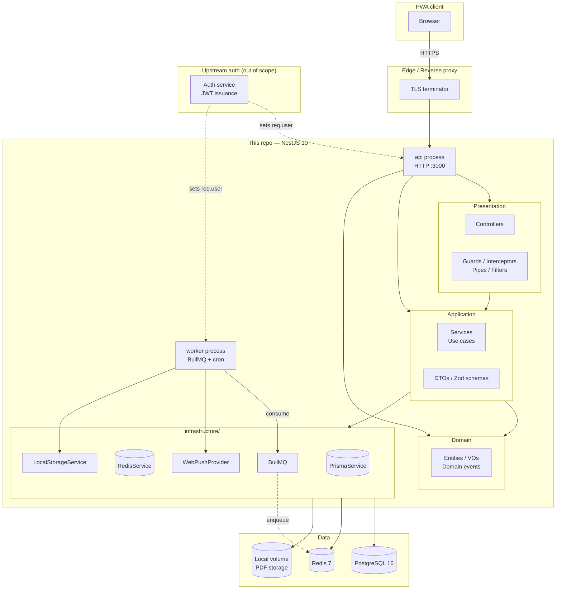
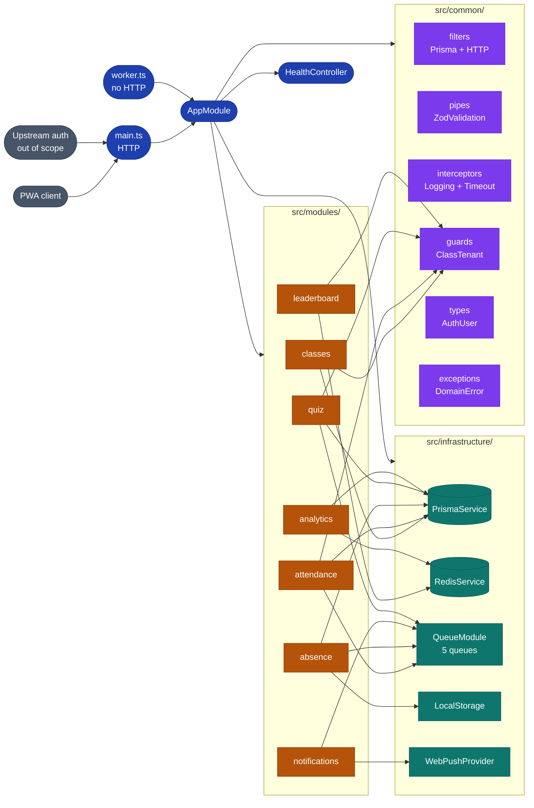
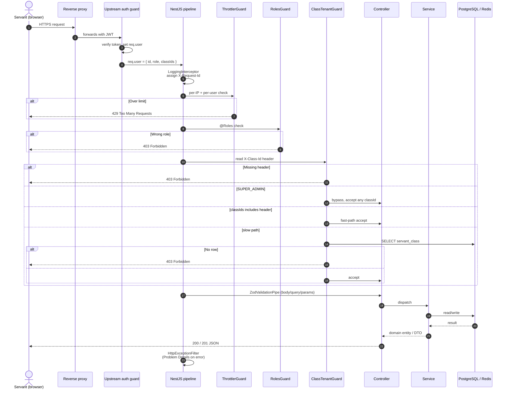
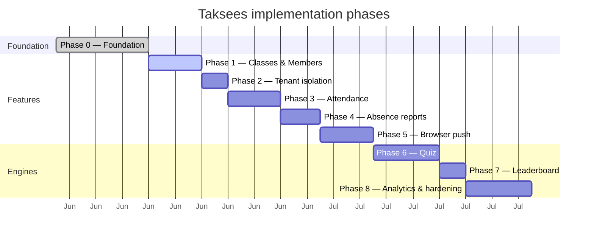

# Taksees — Backend

> Multi-class Sunday-school management backend. NestJS 10 + Prisma + PostgreSQL + Redis + BullMQ.

Taksees (Arabic: طقسيس) powers rosters, attendance, absence reports, quizzes, and leaderboards for a network of classes (Primary 1–6, Secondary, College), each with its own leader, servants, and members. A PWA client consumes the JSON API; push notifications are delivered via the Web Push API.

---

## Table of contents

- [Why Taksees exists](#why-taksees-exists)
- [Architecture at a glance](#architecture-at-a-glance)
- [Module map](#module-map)
- [Request lifecycle](#request-lifecycle)
- [Data model](#data-model)
- [Tech stack](#tech-stack)
- [Quick start](#quick-start)
- [Project layout](#project-layout)
- [API surface](#api-surface)
- [Phase roadmap](#phase-roadmap)
- [Operations](#operations)
- [Development workflow](#development-workflow)
- [License](#license)

---

## Why Taksees exists

A servant may be assigned to multiple classes and may use multiple devices. The classic single-flag `isActive` pattern breaks: switching classes on a mobile app would silently deactivate the class open in a desktop browser. Taksees solves this by:

1. **No global "active class" flag.** The client sends `X-Class-Id` on every request.
2. **Stateless tenant guard.** `ClassTenantGuard` validates the header against the user's allowed class set (from a JWT claim, with a DB fallback).
3. **Scalable leaderboard scoring.** `score = points + (1 − elapsed / maxDuration)` — integer part = points, decimal part = speed tie-breaker. Safe in IEEE 754 doubles.
4. **No IAM in this repo.** A separate auth service issues tokens; this service consumes `req.user = { id, role, classIds }`.
5. **No S3, no FCM, no SMS, no WhatsApp.** Local volume storage, Web Push only. Interfaces preserved for future swap.

See [`docs/decisions/`](./docs/decisions) (out-of-tree, kept for reference) for the full ADRs.

---

## Architecture at a glance

Taksees follows a strict **Clean Architecture / Hexagonal** layout inside NestJS. The dependency rule is non-negotiable: outer layers depend on inner, never the reverse.



**Dependency rule**

```
Presentation → Application → Domain
Infrastructure → Application → Domain
```

The Domain layer has zero project references. The Application layer depends only on Domain. Infrastructure implements Application interfaces.

---

## Module map

Every feature lives in `src/modules/<name>/` with the same internal layout: `domain/`, `dto/`, `services/`, `controllers/`, `workers/`, `cron/`. Cross-cutting concerns live in `src/common/`. Adapters live in `src/infrastructure/`.



---

## Request lifecycle

A class-scoped request flows through six gates. Every layer is a deliberate boundary.



---

## Data model

PostgreSQL 16 via Prisma 5. The full schema lives in `prisma/schema.prisma`. See the high-level relationships below.

```mermaid
erDiagram
    USER ||--o{ SERVANT_CLASS : "assigned to"
    USER ||--o| CLASS : "leads (1:1)"
    USER ||--o{ PUSH_SUBSCRIPTION : "subscribed"
    USER ||--o{ QUIZ_ATTEMPT : "submitted"
    USER ||--o{ MEMBER_STAT : "has stats"

    CLASS ||--o{ MEMBER : "roster"
    CLASS ||--o{ SERVANT_CLASS : "servants"
    CLASS ||--o{ SESSION : "sessions"
    CLASS ||--o{ QUIZ : "quizzes"
    CLASS ||--o{ MEMBER_STAT : "scoped stats"

    MEMBER ||--o{ ATTENDANCE : "check-in"
    MEMBER ||--o{ SCORE : "best-of"
    MEMBER ||--o{ QUIZ_ATTEMPT : "submitted"
    MEMBER ||--o{ MEMBER_STAT : "stat row"

    SESSION ||--o{ ATTENDANCE : "tracks"
    SESSION ||--o| ABSENCE_REPORT : "produces"

    QUIZ ||--o{ QUIZ_ATTEMPT : "attempts"
    QUIZ ||--o{ SCORE : "best-of"

    USER {
        uuid id PK
        string email UK
        string name
        string phone
        enum role
    }
    CLASS {
        uuid id PK
        string name
        enum level
        uuid leaderId UK,FK
    }
    MEMBER {
        uuid id PK
        uuid classId FK
        uuid userId UK
        string fullName
        string phone
        bool isActive
    }
    SERVANT_CLASS {
        uuid servantId PK,FK
        uuid classId PK,FK
    }
    PUSH_SUBSCRIPTION {
        uuid id PK
        uuid userId FK
        string endpoint UK
        string p256dh
        string auth
    }
    SESSION {
        uuid id PK
        uuid classId FK
        datetime date
        enum status
        uuid openedBy
    }
    ATTENDANCE {
        uuid sessionId PK,FK
        uuid memberId PK,FK
        bool checkedIn
    }
    ABSENCE_REPORT {
        uuid id PK
        uuid sessionId UK,FK
        string pdfPath
    }
    QUIZ {
        uuid id PK
        uuid classId FK
        string title
        json questions
        int durationSec
        datetime startsAt
        datetime endsAt
        enum status
        int maxAttempts
    }
    QUIZ_ATTEMPT {
        uuid id PK
        uuid quizId FK
        uuid memberId FK
        json answers
        int points
        int timeMs
    }
    SCORE {
        uuid quizId PK,FK
        uuid memberId PK,FK
        int bestPoints
        int bestTimeMs
        int attemptsCount
    }
    MEMBER_STAT {
        uuid memberId PK,FK
        uuid classId PK,FK
        int currentStreak
        int longestStreak
        datetime lastAttendedAt
        int totalSessions
        int totalQuizzes
        float avgPoints
    }
```

The full model — with all indexes, the partial unique index on `Session(status='OPEN')` per class, and audit fields — is documented in `docs/data-model.md` (kept out of git).

---

## Tech stack

| Concern          | Choice                          | Rationale                                                       |
| ---------------- | ------------------------------- | --------------------------------------------------------------- |
| Framework        | NestJS 10 + TypeScript 5 strict | DI, modular, opinionated                                        |
| ORM              | Prisma 5                        | Schema-first, type-safe, simple migrations                      |
| Database         | PostgreSQL 16                   | Composite keys, JSONB, partial indexes                          |
| Cache / ZSET     | Redis 7                         | Sorted sets for O(log n) leaderboard                            |
| Queue            | BullMQ                          | Durable jobs, retries, DLQ, idempotent jobs                     |
| Validation       | Zod                             | Schema reuse client↔server, strong TS inference                  |
| Storage          | Local volume (`IFileStorage`)   | Swap to S3 later via interface, no business-code changes        |
| PDF              | pdfkit                          | Headless-free, fast, low memory                                 |
| Push             | web-push (VAPID)                | PWA client, no Google/Apple dependency                          |
| Logging          | pino + nestjs-pino              | Structured JSON, PII redaction, fastest in Node                 |
| API docs         | @nestjs/swagger                 | Auto-generated OpenAPI at `/docs`                               |
| Rate limit       | @nestjs/throttler               | Per-IP + per-user rules                                         |
| Health           | @nestjs/terminus                | DB / Redis / queues / disk probes                               |
| Tests            | Jest                            | Unit + e2e (Testcontainers in CI)                                |
| Containers       | Docker + docker-compose         | `api` + `worker` + `postgres` + `redis`                         |
| CI               | GitHub Actions                  | lint → test → build → docker build                              |

---

## Quick start

```bash
# 1. Prerequisites: Node 22.16, pnpm 9, Docker
node --version    # v22.16.0
pnpm --version    # 9.15.0
docker --version

# 2. Install deps
pnpm install

# 3. Generate the Prisma client
pnpm prisma generate

# 4. Configure env
cp .env.example .env
# Edit .env: set DATABASE_URL, REDIS_URL, FILE_SIGNING_SECRET, VAPID_*

# 5. Start infrastructure
docker compose up -d postgres redis

# 6. Run migrations
pnpm prisma migrate dev

# 7. Boot the API (hot-reload)
pnpm run start:dev
# or
pnpm run build && pnpm run start:prod

# 8. In a second terminal, boot the worker
pnpm run start:worker
```

Once running:

| URL                                          | Purpose                                |
| -------------------------------------------- | -------------------------------------- |
| `http://localhost:3000/health`               | Liveness + readiness                   |
| `http://localhost:3000/docs`                 | Swagger UI                             |
| `http://localhost:3000/docs-json`            | Raw OpenAPI 3 spec                     |
| `http://localhost:3000/api/...`              | All business endpoints                 |

---

## Project layout

```
.
├── src/
│   ├── main.ts                  # HTTP entry (port 3000)
│   ├── worker.ts                # Worker entry (BullMQ + cron, no HTTP)
│   ├── app.module.ts            # Root module with global providers
│   ├── config/
│   │   ├── env.validation.ts    # Zod schema (fail-fast on boot)
│   │   └── configuration.ts     # Typed AppConfig factory
│   ├── common/
│   │   ├── types/               # AuthUser contract
│   │   ├── exceptions/          # DomainError base class
│   │   ├── filters/             # Prisma + HTTP → RFC 7807
│   │   ├── pipes/               # ZodValidationPipe
│   │   └── interceptors/        # Logging, Timeout
│   ├── infrastructure/
│   │   ├── database/            # PrismaService, base helpers
│   │   ├── cache/               # RedisService (ioredis)
│   │   ├── queue/               # BullMQ + 5 queue constants
│   │   ├── storage/             # LocalStorageService
│   │   └── push/                # WebPushProvider (VAPID)
│   ├── modules/                 # Feature modules (per phase)
│   │   ├── classes/             # Phase 1
│   │   ├── attendance/          # Phase 3
│   │   ├── absence/             # Phase 4
│   │   ├── notifications/       # Phase 5
│   │   ├── quiz/                # Phase 6
│   │   ├── leaderboard/         # Phase 7
│   │   └── analytics/           # Phase 8
│   └── health/                  # Liveness + readiness
├── prisma/
│   ├── schema.prisma            # Single source of truth for DB
│   └── migrations/              # Versioned SQL migrations
├── test/                        # e2e tests (Testcontainers)
├── docs/                        # Specs (kept out of git)
├── .github/workflows/           # CI
├── docker-compose.yml           # postgres + redis + api + worker
├── Dockerfile.api               # API image (multi-stage, non-root)
├── Dockerfile.worker            # Worker image (same base)
└── ...
```

---

## API surface

All business endpoints live under `/api`. Class-scoped routes require the `X-Class-Id` header. All errors follow RFC 7807 ProblemDetails. Full per-module specs live in `docs/api/`:

| Module        | Doc                                  | Endpoints |
| ------------- | ------------------------------------ | --------- |
| Classes       | [`classes.md`](./docs/api/classes.md) | 13 |
| Attendance    | [`attendance.md`](./docs/api/attendance.md) | 6 |
| Absence       | [`absence.md`](./docs/api/absence.md) | 2 |
| Notifications | [`notifications.md`](./docs/api/notifications.md) | 3 |
| Quiz          | [`quiz.md`](./docs/api/quiz.md) | 12 |
| Leaderboard   | [`leaderboard.md`](./docs/api/leaderboard.md) | 3 |
| Analytics     | [`analytics.md`](./docs/api/analytics.md) | 2 |

---

## Phase roadmap

Eight phases, each independently shippable behind a feature flag.



| #  | Phase                          | Est. effort | Status   |
| -- | ------------------------------ | ----------- | -------- |
| 0  | Foundation                     | 2–3 d       | ✅ Done   |
| 1  | Classes & Members              | 3–4 d       | ✅ Done   |
| 2  | Tenant Isolation               | 2 d         | ⏳ Next   |
| 3  | Attendance                     | 3–4 d       | Planned  |
| 4  | Absence Reports (PDF)          | 3 d         | Planned  |
| 5  | Browser Push                   | 4 d         | Planned  |
| 6  | Quiz                           | 5 d         | Planned  |
| 7  | Leaderboard                    | 2 d         | Planned  |
| 8  | Analytics & Hardening          | 4–5 d       | Planned  |

---

## Operations

### Health check

`GET /health` returns 200 with all indicators green, 503 otherwise:

```json
{
  "status": "ok",
  "info": {
    "database": { "status": "up" },
    "redis":    { "status": "up", "reply": "PONG" },
    "queues":   { "status": "up", "absence": { "waiting": 0, ... } },
    "disk":     { "status": "up", "freeGb": 880.95, "thresholdGb": 1 }
  }
}
```

### Logs

Structured JSON to stdout via pino. PII redaction middleware strips `authorization`, `cookie`, `password`, `token`, and `passwordHash`. Every log line includes `requestId` (also returned as `X-Request-Id` header).

### Restart a service

```bash
docker compose restart api        # NestJS HTTP
docker compose restart worker     # BullMQ consumers
```

### Drain a queue

```bash
docker compose exec worker node -e "
  const { Queue } = require('bullmq');
  const q = new Queue('notifications.push', { connection: { host: 'redis' } });
  q.pause();
"
```

### Rotate VAPID keys

```bash
npx web-push generate-vapid-keys
# Update .env with VAPID_PUBLIC_KEY_2 / VAPID_PRIVATE_KEY_2
# Restart api + worker
```

Full runbook: see `docs/operations/runbook.md` (out-of-tree).

---

## Development workflow

```bash
# Lint (0 errors, 0 warnings)
pnpm run lint

# Format check
pnpm run format:check

# Unit tests (21 specs across 3 suites)
pnpm test

# Build
pnpm run build

# Dev (hot reload)
pnpm run start:dev

# Open Prisma Studio
pnpm prisma:studio

# Create a migration
pnpm prisma migrate dev --name <change>

# Apply pending migrations in production
pnpm prisma:deploy
```

### Adding a new env variable

1. Add it to `src/config/env.validation.ts` (Zod).
2. Add it to `src/config/configuration.ts` (`AppConfig`).
3. Consume via `ConfigService<AppConfig, true>` and `config.get('<name>', { infer: true })`.
4. Document in `.env.example`.

### Adding a new BullMQ queue

1. Add the name to `src/infrastructure/queue/queue.constants.ts` (`QUEUE_NAMES`).
2. Register it in `src/infrastructure/queue/queue.module.ts` (`BullModule.registerQueue`).
3. Add a worker with `@Processor('<name>')` in the relevant module.
4. Add a health indicator entry if it should be probed.

### Adding a new endpoint

1. Define a Zod schema in `src/modules/<name>/dto/`.
2. Add a controller method with `@UsePipes(new ZodValidationPipe(<schema>))`.
3. Apply the appropriate guards: `@UseGuards(JwtAuthGuard, RolesGuard, ClassTenantGuard)`.
4. Document in `docs/api/<name>.md`.

---

## Contributing

1. Open an issue describing the change.
2. Branch from `master`: `git checkout -b feat/<short-name>`.
3. Follow the existing layout (one module per concern, one Zod schema per DTO).
4. Run `pnpm run lint && pnpm test && pnpm run build` before opening a PR.
5. Add or update tests for any business logic.
6. Reference the relevant phase file in `docs/phases/`.

---

## License

UNLICENSED — proprietary to the project owners.
